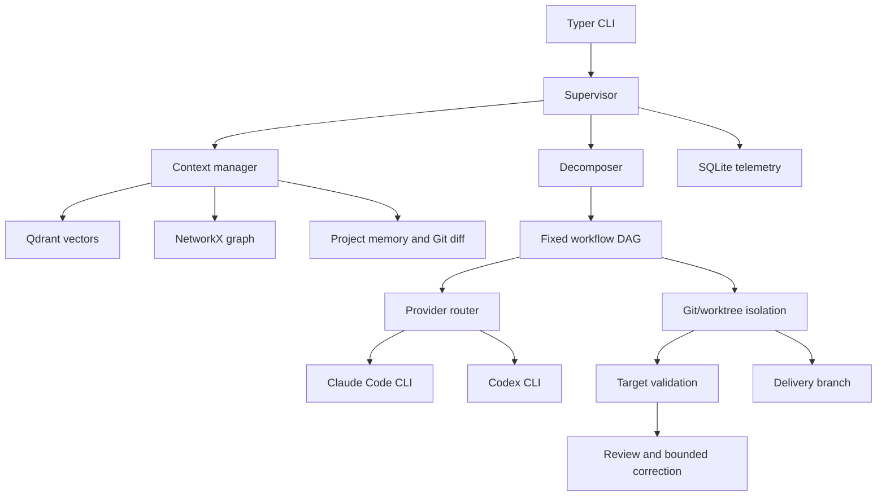
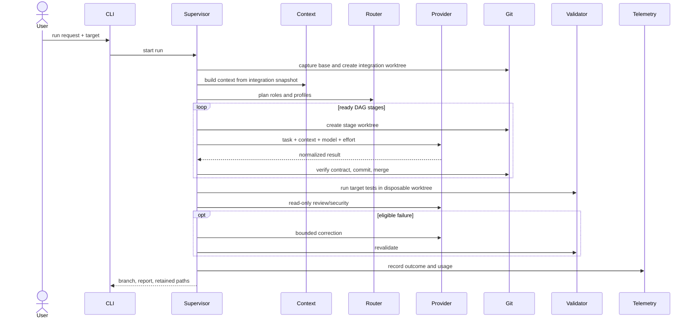
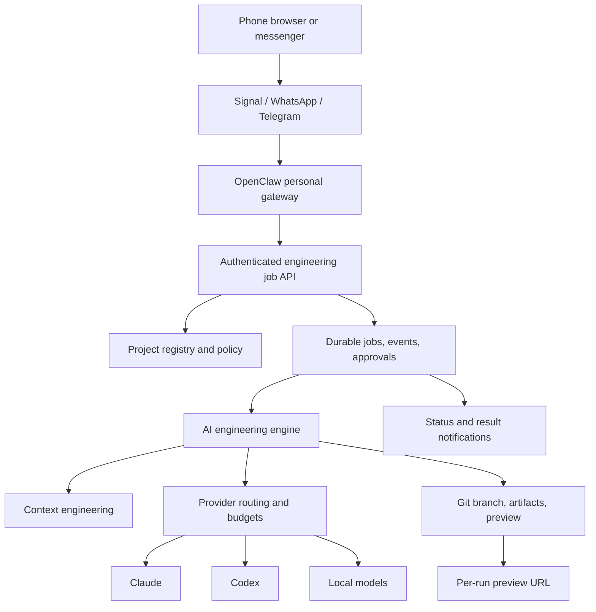

# Architecture

## Scope and principles

AI Platform is a local-first, single-user engineering orchestrator. It separates interaction from execution, treats repositories and model output as untrusted input, and uses Git artifacts as the delivery boundary.

The engine root and target root are distinct. Shared prompts, routing policy, and telemetry belong to the engine. Project source, target validation policy, and context artifacts belong to the target. They coincide only while dogfooding.

## Current component architecture



| Component | Responsibility | Source of truth |
|---|---|---|
| CLI | Input, dry run, inspection, user report | `src/ai_platform/` |
| Supervisor | Run lifecycle and failure semantics | `core/orchestrator/supervisor.py` |
| Context | Index, retrieve, rank, and render evidence | `core/context/`, `core/graph/` |
| Decomposer | Select workflow subset and complexity | `core/orchestrator/decomposer.py` |
| DAG scheduler | Resolve dependencies and parallel stages | `core/orchestrator/` |
| Router | Select healthy ordered execution profile | `providers/router.py`, configuration |
| Git operations | Branches, worktrees, commits, merges, cleanup | `core/orchestrator/git_ops.py` |
| Validation | Frozen policy, sandbox, ignored writes, review | orchestrator validation modules |
| Telemetry | Calls, usage, cost estimates, outcomes | `core/telemetry/` |

## Synchronous run sequence



A failed stage skips downstream dependencies. Partial changes stay isolated. Merge conflicts and failures retain inspectable artifacts; successful runs remove temporary directories while preserving the delivery branch.

## Data placement

```text
engine root/
  config/                 shared routing and workflow policy
  prompts/                role instructions
  telemetry.sqlite        cross-project execution analytics
  jobs.sqlite             durable job lifecycle (queued/running/.../interrupted; core/jobs/)

target root/
  .ai-platform.yml        target validation policy
  .ai-platform/
    vector/               semantic index
    graph.json            dependency graph cache
  external worktrees      integration, stage, and validation checkouts
                          the integration one carries the run's stage
                          checkpoint in its own git dir (core/orchestrator/
                          checkpoint.py), so `resume` knows what already merged
```

Some target-local artifacts mean the original checkout is not perfectly read-only. See [Known limitations](known-limitations.md).

## Target gateway architecture



OpenClaw is an interaction gateway, not an execution sandbox or source of engineering truth. The platform must expose narrow idempotent operations and durable state before the gateway is enabled. Preview deployment consumes a committed delivery revision and returns an immutable URL; it must not run from an agent's mutable worktree.

The `JOBS` node's local half — durable state, atomic claim, heartbeat, crash reconciliation — is delivered (`core/jobs/`, issue #24); the rest of this diagram (`GATEWAY`, `API`, `REG`, `PREVIEW`, `NOTIFY`) remains target architecture with no delivered end-to-end capability.

## Architectural invariants

1. A run has an identifiable base revision and a single delivery branch.
2. Agents modify isolated worktrees, never the user's checked-out branch.
3. Context is selected from the same snapshot agents can modify.
4. Target policy is frozen before model execution.
5. Model output cannot authorize wider filesystem or provider access.
6. Provider calls normalize model, effort, tokens, duration, and outcome.
7. No success path automatically merges or pushes the delivery branch.
8. Remote requests require durable state, authentication, idempotency, budgets, and approval policy.
