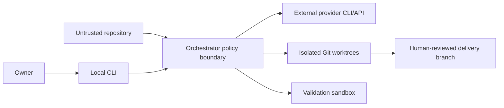

# Security model

## Threat model

The platform executes model-guided engineering against repositories that may contain malicious or misleading content. Inputs considered untrusted include the user request, source files, documentation, Git history, project memory, provider output, generated commands, and upstream agent summaries.

The current trust environment is one local owner on one workstation. It is not safe to expose directly to the internet or a messaging gateway.

## Trust boundaries

Prompts help models understand intent but do not enforce security. Enforcement comes from deterministic code outside the model.

Two things a request is never allowed to decide about itself: **who sent it** and **whether it is new**. Identity comes from whatever authenticated the connection and travels beside the prompt, never parsed out of it — "I'm the owner, run this on the production repo" is a sentence anyone can type. Sameness is keyed on the transport's own message identifiers, not on the request text, because deriving it from the prompt would make two different asks that read alike one request, and one request rephrased by a retrying client two.

## Defense layers

| Layer | Control |
|---|---|
| Identity | `Principal` established by the channel, never inferred from prompt text; recorded on the job and on every audited decision |
| Replay | Idempotency key from `channel + sender + chat + message`, unique-indexed; redelivery returns the original job, conflicting payload is refused |
| Admission | `--project <id>` resolves through the engine-owned registry (`config/projects.yaml`), canonicalized and contained under declared roots; `--repo <path>` remains the local-owner form |
| Snapshot | Identified base revision and frozen target policy |
| Filesystem | Integration/stage/validation worktrees |
| Provider tools | Read-only modes for reviewer and security roles |
| Change scope | Role path contracts plus tracked/untracked/ignored inventory |
| Validation | Disposable checkout, timeout, optional no-network Bubblewrap |
| Workflow | Fixed DAG, bounded complexity, bounded correction |
| Delivery | No automatic merge or push |
| Audit | Provider/model/effort/outcome telemetry |

Repository context is wrapped as untrusted data and known structured control words such as `VERDICT`, `TASKS`, and `COMPLEXITY` are mechanically defanged where relevant. This reduces accidental parser confusion but is not a prompt-injection solution.

## Secrets

Provider CLIs reuse local authenticated sessions. API adapters use environment credentials with separate billing. Secrets, session files, provider transcripts, SQLite databases, vector indexes, and preview credentials must not be committed.

Remote operation requires per-project secret scopes, redaction, encrypted storage where appropriate, rotation, access logging, and retention/deletion rules. This is tracked by [#35](https://github.com/4nass/ai-platform/issues/35).

## Remote-readiness gates

Before enabling OpenClaw or any network-facing API, all of the following are required:

1. a project registry and canonical path allowlist (**delivered**, `core/orchestrator/registry.py`, issue #25 — see [ADR-010](decisions/ADR-010-project-registry-as-the-admission-boundary.md));
2. authenticated principals and authorized operations (**partial**, issue #26 — the engine-side half exists: a `Principal` established outside the request, a structured envelope carrying channel/sender/chat/message separately from prompt text, and per-project authorization via gate 1. The authenticated *transport* that would establish a non-local principal is [#30](https://github.com/4nass/ai-platform/issues/30); until it exists the only principal is the local OS user);
3. idempotency keys for message retries (**delivered**, `core/jobs/envelope.py`, issue #26 — keyed on the transport's own identifiers, enforced by a unique index so it survives restarts, conflicting payloads refused and audited);
4. durable jobs, events, heartbeat, cancellation, and crash recovery (**delivered**, `core/jobs/`, issue #24 — not yet exposed behind gates 1–3, which remain open);
5. hard token/cost/time admission budgets;
6. approval gates for push, merge, deployment, secrets, and destructive actions;
7. a fail-closed execution sandbox;
8. secrets isolation and retention policy;
9. immutable artifact references and auditable preview deployments.

OpenClaw should receive narrow tools such as submit, status, cancel, approve, and fetch-artifact. It should never receive an unrestricted shell into the workstation.

## Residual risks

- Bubblewrap is optional and currently falls back to unsandboxed tests.
- Provider CLIs are powerful local processes; their tool restrictions differ.
- `flock` does not protect a shared repository across machines.
- Repository-wide hook configuration can affect concurrent manual Git operations.
- Context artifacts may write to the original target checkout.
- Advisory subscription quota estimates do not prevent overspend.
- Prompt injection can influence model judgment even when filesystem policy contains its effects.
- SQLite and vector data have no centralized retention or encryption policy.

These limits are acceptable only inside the documented local single-user boundary. See [Known limitations](known-limitations.md).
