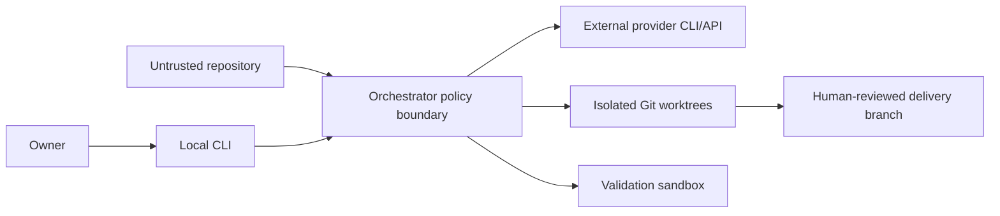

# Security model

## Threat model

The platform executes model-guided engineering against repositories that may contain malicious or misleading content. Untrusted inputs include the user request, source files, documentation, Git history, project memory, provider output, generated commands and upstream agent summaries.

The current trust environment is one local owner on one workstation. It is not safe to expose directly to the Internet or a messaging gateway until the remote gates below are complete.

## Trust boundaries

Prompts help models understand intent but do not enforce security. Enforcement comes from deterministic code outside the model.

A request is never allowed to decide who sent it or whether it is new. Identity comes from the authenticated channel and travels beside the prompt; idempotency is keyed on the transport message identifiers, not on request text.

## Defense layers

| Layer | Control |
|---|---|
| Identity | HMAC-signed transport credential establishes a channel-scoped `Principal`; never inferred from prompt text; recorded on the job and audited decisions |
| Replay | Signed timestamp/nonce plus durable `ReplayStore`; idempotency key from `channel + sender + chat + message`, unique-indexed; identical redelivery returns the original job and conflicting payloads are refused |
| Admission | `--project <id>` resolves through `config/projects.yaml`; paths are canonicalized, contained and re-checked at claim time |
| Snapshot | Identified base revision and frozen target policy |
| Filesystem | Integration, stage and validation worktrees |
| Provider tools | Read-only modes for reviewer and security roles |
| Change scope | Role path contracts plus tracked/untracked/ignored inventory |
| Budget | Reservation before every provider call, summed across concurrent runs; `strict` pauses rather than overruns |
| Validation | Disposable checkout, timeout and optional no-network Bubblewrap |
| Workflow | Fixed DAG, bounded complexity and bounded correction |
| Approval | Consequential actions classified automatic, denied or approval-required; approval is fingerprint-bound, single-use and expiring |
| Delivery | No automatic merge or push |
| Audit | Provider/model/effort/outcome telemetry plus append-only submission, refusal and approval events |

Repository context is wrapped as untrusted data and control words such as `VERDICT`, `TASKS` and `COMPLEXITY` are mechanically defanged where relevant. This reduces parser confusion but is not a prompt-injection solution; containment comes from tool restrictions, contracts, the test sandbox and no automatic delivery.

## Secrets

Provider CLIs reuse local authenticated sessions. API adapters use environment credentials with separate billing. Secrets, provider transcripts, SQLite databases, vector indexes and preview credentials must not be committed.

Remote operation requires per-project secret scopes, redaction, encrypted storage where appropriate, rotation, access logging and retention/deletion rules. This is tracked by [#35](https://github.com/4nass/ai-platform/issues/35).

## Remote-readiness gates

Before enabling OpenClaw or any network-facing API, all of the following are required:

1. a project registry and canonical path allowlist (**delivered**, `core/orchestrator/registry.py`, #25);
2. an authenticated principal and authorized operations (**engine delivered**, #26/#44; REST/SSE exposure and final remote gate remain #47/#49);
3. idempotency keys for message retries (**delivered** in `core/jobs/envelope.py`, #26);
4. durable jobs, heartbeat and crash recovery (**delivered** in `core/jobs/`, #24), plus structured progress events and cooperative cancellation (**planned**, #29);
5. hard token/call admission budgets (**delivered** in `core/jobs/budget.py`, #27); elapsed-time and currency ceilings remain;
6. approval gates plus an audited external-action executor library (core/jobs/approvals.py and core/actions/executor.py, #28/#46); no CLI, worker or REST caller instantiates it yet;
7. a fail-closed execution sandbox;
8. secrets isolation and retention policy;
9. immutable artifact references and auditable preview deployments.

OpenClaw should receive narrow tools such as submit, status, events, cancel, approve/deny and fetch-artifact. It should never receive an unrestricted shell into the workstation.

## Residual risks

- Bubblewrap is optional and currently falls back to unsandboxed tests with a warning.
- Provider CLIs are powerful local processes and their tool restrictions differ.
- `flock` does not protect a shared repository across machines.
- Repository-wide hook configuration can affect concurrent manual Git operations.
- Context artifacts may write to the original target checkout.
- Advisory subscription quota estimates do not prevent overspend; hard token/call budgets do not yet cover time/currency.
- Prompt injection can influence model judgment even when filesystem policy contains its effects.
- SQLite and vector data have no centralized retention or encryption policy.

These limits are acceptable only inside the documented local single-user boundary. See [Known limitations](known-limitations.md) and [MVP trajectory](mvp-trajectory.md).
