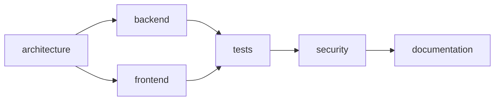

# Workflow and agents

## Fixed, prunable workflow

The workflow is a declared DAG, not an unconstrained model-generated plan.

The decomposer chooses a subset of configured tasks and classifies the run as `routine`, `complex`, or `critical`. Dependencies are bridged when an intermediate task is omitted. Unknown tasks and malformed output are rejected or normalized to the safe bounded policy; malformed complexity falls back to `complex`.

This design provides predictable roles and contracts. Arbitrary plan synthesis is not delivered and is tracked by [#18](https://github.com/4nass/ai-platform/issues/18).

## Roles

| Role | Primary responsibility | Typical write scope |
|---|---|---|
| decomposer | Select tasks and run complexity | none |
| architect | Design and cross-cutting constraints | declared architecture/document paths |
| backend | Application and service implementation | broad project code |
| frontend | User-interface implementation | broad project code |
| tests | Test implementation and verification | broad project/test code |
| security | Read-only security analysis | none |
| reviewer | Read-only final correctness review | none |
| documentation | User and technical documentation | documentation paths |
| corrector | Repair eligible validation/review failures | bounded by correction policy |

The exact workflow and contracts live in `config/presets/workflow/<mode>.yaml` and role prompts under `prompts/`.

## Scheduling

Ready stages are executed up to `max_parallel` (currently 2). Writable stages get independent branches and worktrees. A stage receives:

- the user request;
- its role instructions;
- selected repository context;
- explicit upstream stage artifacts;
- its provider, model, effort, and run complexity;
- its authorized working directory and contract.

A stage succeeds only when the provider returns success, its changed paths satisfy the contract, its changes can be committed, and its branch merges into the integration worktree.

Upstream provider prose is data, not executable control. The platform still needs stronger factual filtering of hand-off artifacts; review usefulness is tracked in [#14](https://github.com/4nass/ai-platform/issues/14), and upstream prompt dependency behavior in [#6](https://github.com/4nass/ai-platform/issues/6).

## Failure semantics

- Provider failure marks the stage failed.
- Contract violation rejects the stage changes.
- Failed stages cause their dependents to be skipped.
- Independent stages may continue.
- Merge conflict retains artifacts and requires attention.
- A DAG failure does not enter the generic corrector.
- Target-test or final-review failure may enter correction.
- Correction attempts are limited by `max_correction_attempts` (currently 1).

A run report must distinguish failed, skipped, validation-failed, review-failed, corrected, and successful outcomes.

## Dry run

Dry run inspects decomposition, dependencies, context, and routing without launching writable agents. The decomposer may still be called, so dry run is not necessarily provider-free. This visibility gap is tracked by [#15](https://github.com/4nass/ai-platform/issues/15).

## Prompt contract

Prompts define role intent and structured footers, but cannot grant filesystem access or expand the target policy. Prompt updates are behavior changes: they require tests for parsers and contracts, plus documentation when they alter the public workflow.
